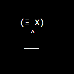

# Nft with whitelist

Creating two contracts.

1. A nft contract including the ERC721 standard which will create different AsciiFaces fully onchain
2. An AccessControl contract which defines which adddress can mint what number of elements of the nft contract given in 1.

## Nft contract - OnChainNftMintContract

Creating fully onchain generated AsciiFaces using base64 encoding and svg creation - no need for storing the picture/image/svg on any decentralized/centralized storage.
Defining all possible mint combinations during deployment of the contract.

## AccessControl contract

The AccessControl contract lets the owner add addresses and the allowed nr of elements which the address is able to mint.

## Realization of a whitelist

The whitelist is realized by linking the nft contract with the AccessControl contract and vice versa. This ensures that the mint function of the nft contract can only be accessed by addresses which are granted access
from the AccessControl access during non-public mint.

# Prerequisites
<ul  dir="auto">
<li><a  href="https://nodejs.org/en/download/"  rel="nofollow">Nodejs and npm</a>
You'll know you've installed nodejs right if you can run:
<code>node --version</code> and get an ouput like: <code>vx.x.x</code>
</ul>
<ul  dir="auto">
<li><a  href="https://hardhat.org/getting-started/"  rel="nofollow">hardhat</a>
You'll know you've installed hardhat right if you can run:
<code>npx hardhat --version</code> and get an ouput like: <code>2.9.3</code>
</ul>
<ul  dir="auto">
A webbrowser, since you can read this here I should not have to  mention it^^
</ul>
<ul  dir="auto">
Basic understand of js, hardhat and solidity. If you want to get basic understanding up to expert I highly recommend
the man, the myth, the legend: <a href="https://www.youtube.com/watch?v=M576WGiDBdQ&t=10s">Patrick Collins</a>
</ul>

# dependencies
### openzeppelin
    ´npm install --save-dev @openzeppelin/contracts´
    

